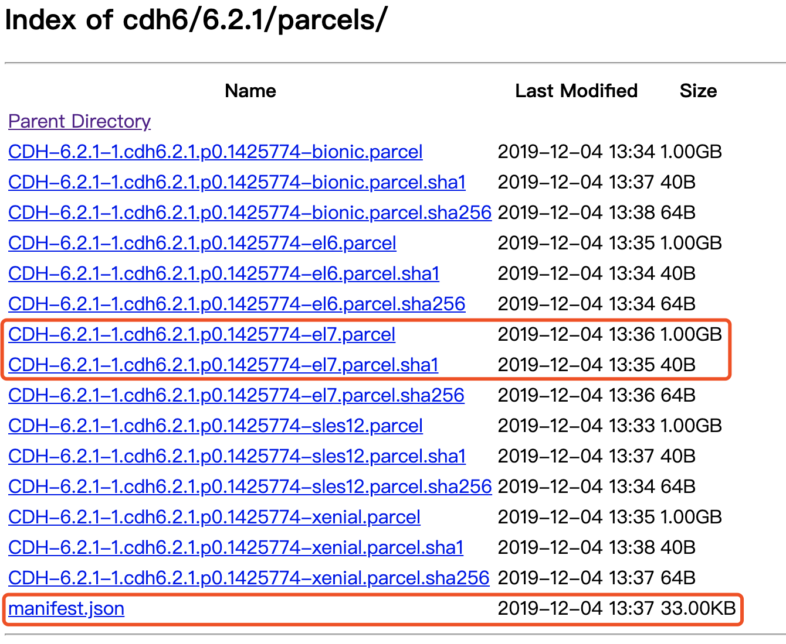

# Cloudera Manager 5.16.2 centos7离线安装

# 1.服务器节点规划

机器名 | ip地址 | 操作系统 |
-------------| -------------- | -------------
cdh1.com | 192.21.0.2 | centos7.7
cdh2.com | 192.21.0.3 | centos7.7
cdh3.com | 192.21.0.4 | centos7.7
cdh4.com | 192.21.0.5 | centos7.7

# 2.下载
## Cloudera Manager安装文件下载
[http://archive.cloudera.com/cm5/installer/5.16.2/cloudera-manager-installer.bin](http://archive.cloudera.com/cm5/installer/5.16.2/cloudera-manager-installer.bin)


## 2.1 CM软件包下载
[http://archive.cloudera.com/cm5/redhat/7/x86_64/cm/5.16.2/RPMS/x86_64/](http://archive.cloudera.com/cm5/redhat/7/x86_64/cm/5.16.2/RPMS/x86_64/)

红框所圈为必须要下载的rpm包，其它包可选。

## 2.2 Parcels下载
[http://archive.cloudera.com/cdh5/parcels/5.16.2.8/](http://archive.cloudera.com/cdh5/parcels/5.16.2.8/)


el7 对应centos7  
el6 对应centos6

注：*parcel、sha1、manifest三个文件传至指定目录*：/opt/cloudera/parcel-repo


## 2.3 仓库文件下载
[cloudera-manager.repo](http://archive.cloudera.com/cm5/redhat/7/x86_64/cm/cloudera-manager.repo)


其它rpm包及bin文件存放目录不限


# 3. 安装
## 3.1 MYSQL安装
官网文档强调：

* 数据库需要使用UTF8编码。对于MySQL和MariaDB，必须使用UTF8编码，而不是utf8mb4
* 对于MySQL5.7，必须要额外安装MySQL-shared-compat或者MySQL-shared包

mysql安装参考文献：[CDH 依赖的MySQL 数据库安装配置说明](https://www.cndba.cn/cndba/dave/article/3374)

### 3.1.1 复制mysql驱动包
将 mysql-connector-java-5.1.47-bin.jar 文件上传至 CM Server节点上的 /usr/share/java/ 目录下并重命名为mysql-connector-java.jar（如果/usr/share/java/目录不存在，需要手动创建）
```shell script
mkdir /usr/share/java
cp mysql-connector-java-5.1.47.jar /usr/share/java/mysql-connector-java.jar
```


### 3.1.2 创建数据库、用户并授权

**服务名** | 数据库 | 用户
-----------------| -------------- |------------
Cloudera Manager Server | scm   | scm
Activity Monitor |	amon | amon
Reports Manager	| rman | rman
Hue		| hue | hue
Hive Metastore Server | hive | hive
Sentry Server | sentry | sentry
Cloudera Navigator Audit Server	| nav | nav
Cloudera Navigator Metadata Server | navms | nav
Oozie	| oozie | oozie


```
-- 注意scm的数据库不需要创建，在CDH 数据库初始化时会自动创建
create database scm default character set utf8 default collate utf8_general_ci;
grant all on scm.* to 'scm'@'%' identified by 'scm';

create database amon default character set utf8 default collate utf8_general_ci;
grant all on amon.* to 'amon'@'%' identified by 'amon';

create database rman default character set utf8 default collate utf8_general_ci;
grant all on rman.* to 'rman'@'%' identified by 'rman';

create database hue default character set utf8 default collate utf8_general_ci;
grant all on hue.* to 'hue'@'%' identified by 'hue';

create database hive default character set utf8 default collate utf8_general_ci;
grant all on hive.* to 'hive'@'%' identified by 'hive';

create database sentry default character set utf8 default collate utf8_general_ci;
grant all on sentry.* to 'sentry'@'%' identified by 'sentry';

create database nav default character set utf8 default collate utf8_general_ci;
grant all on nav.* to 'nav'@'%' identified by 'nav';

create database navms default character set utf8 default collate utf8_general_ci;
grant all on navms.* to 'navms'@'%' identified by 'navms';

create database oozie default character set utf8 default collate utf8_general_ci;
grant all on oozie.* to 'oozie'@'%' identified by 'oozie';
```


## 3.2 Cloudrea Manager安装

### 3.2.1 修改仓库文件
修改仓库文件cloudera-manager.repo，把版本号加上
  
```shell script
vi cloudera-manager.repo
```
```shell script
[cloudera-manager]
# Packages for Cloudera Manager, Version 5, on RedHat or CentOS 7 x86_64
name=Cloudera Manager
baseurl=https://archive.cloudera.com/cm5/redhat/7/x86_64/cm/5.16.2/   # 主要改这里的版本号
gpgkey =https://archive.cloudera.com/cm5/redhat/7/x86_64/cm/RPM-GPG-KEY-cloudera
gpgcheck = 1
```


* 复制repo文件到 yum 安装源
```shell script
cp cloudera-manager.repo /etc/yum.repos.d
```

 * 验证repo文件是否生效？

 ```shell script
# 清除yum缓存
yum clean all
# 列举yum可用的cloudera安装包
yum list | grep cloudera
```
能列出说明仓库有效
```shell script
[root@4fe527430f25 cloudera-manager]# yum list | grep cloudera
cloudera-manager-agent.x86_64             5.16.2-1.cm5162.p0.7.el7       cloudera-manager
cloudera-manager-daemons.x86_64           5.16.2-1.cm5162.p0.7.el7       cloudera-manager
cloudera-manager-server.x86_64            5.16.2-1.cm5162.p0.7.el7       cloudera-manager
cloudera-manager-server-db-2.x86_64       5.16.2-1.cm5162.p0.7.el7       cloudera-manager
enterprise-debuginfo.x86_64               5.16.2-1.cm5162.p0.7.el7       cloudera-manager
jdk.x86_64                                2000:1.6.0_31-fcs              cloudera-manager
oracle-j2sdk1.7.x86_64                    1.7.0+update67-1               cloudera-manager
```

### 3.2.2 安装cloudera-manager依赖的RPM包
切换回/opt/cloudera-manager目录,采用本地安装方式，不会去远程仓库下载rpm包,达到离线安装效果，不做gpg检验
```shell script
yum localinstall --nogpgcheck *.rpm
```
按提示完成即可


### 3.2.3 配置数据库脚本
如果mysql与cm server在同一机器，其传参格式为:  
scm_prepare_database.sh <db.type> <db.name> <db.user>

如果mysql与cm server不在同一服务器，参数格式为：
scm_prepare_database.sh <db.type> -h <mysql-host-ip> --scm-host <cm-server-ip> <db.name> <db.user>

```
[root@4fe527430f25 cloudera-scm-server]# /usr/share/cmf/schema/scm_prepare_database.sh mysql -h mysql.cdh.com --scm-host a.cdh.com scm scm
Enter SCM password:
JAVA_HOME=/usr/local/jdk1.8.0_202
Verifying that we can write to /etc/cloudera-scm-server
Creating SCM configuration file in /etc/cloudera-scm-server
Executing:  /usr/local/jdk1.8.0_202/bin/java -cp /usr/share/java/mysql-connector-java.jar:/usr/share/java/oracle-connector-java.jar:/usr/share/java/postgresql-connector-java.jar:/usr/share/cmf/schema/../lib/* com.cloudera.enterprise.dbutil.DbCommandExecutor /etc/cloudera-scm-server/db.properties com.cloudera.cmf.db.
Mon Mar 02 15:51:59 CST 2020 WARN: Establishing SSL connection without server's identity verification is not recommended. According to MySQL 5.5.45+, 5.6.26+ and 5.7.6+ requirements SSL connection must be established by default if explicit option isn't set. For compliance with existing applications not using SSL the verifyServerCertificate property is set to 'false'. You need either to explicitly disable SSL by setting useSSL=false, or set useSSL=true and provide truststore for server certificate verification.
[                          main] DbCommandExecutor              INFO  Successfully connected to database.
All done, your SCM database is configured correctly!

```
执行完，可查看数据库配置文件：/etc/cloudera-scm-server/db.properties
```shell script
[root@4fe527430f25 cloudera-scm-server]# cat /etc/cloudera-scm-server/db.properties
# Auto-generated by scm_prepare_database.sh on Mon Mar  2 15:51:58 CST 2020
#
# For information describing how to configure the Cloudera Manager Server
# to connect to databases, see the "Cloudera Manager Installation Guide."
#
com.cloudera.cmf.db.type=mysql
com.cloudera.cmf.db.host=mysql.cdh.com
com.cloudera.cmf.db.name=scm
com.cloudera.cmf.db.user=scm
com.cloudera.cmf.db.setupType=EXTERNAL
com.cloudera.cmf.db.password=scm

```


### ~~3.2.3 启动安装器~~
进入cloudera-manager-installer.bin文件目录，赋予可执行权限
 ```shell script
chmod +x cloudera-manager-installer.bin

# 安装
./cloudera-manager-installer.bin --skip_repo_package=1
```
遇到错误提示：
如果要继续安装，要求要删除文件：/etc/cloudera-scm-server/db.properties

删除文件
```shell script
rm /etc/cloudera-scm-server/db.properties
```

重新运行安装命令，按提示一步一步完成即可。


安装JDK时,界面一直卡在20%进度，不动了，推测原因，JDK远程下载太慢。
```shell script
[root@4fe527430f25 cloudera-manager-installer]# cat /var/log/cloudera-manager-installer/1.install-oracle-j2sdk1.7.log
Loaded plugins: fastestmirror, ovl
Loading mirror speeds from cached hostfile
 * base: ap.stykers.moe
 * extras: mirrors.aliyun.com
 * updates: mirrors.cn99.com
Resolving Dependencies
--> Running transaction check
---> Package oracle-j2sdk1.7.x86_64 0:1.7.0+update67-1 will be installed
--> Finished Dependency Resolution

Dependencies Resolved

================================================================================
 Package             Arch       Version              Repository            Size
================================================================================
Installing:
 oracle-j2sdk1.7     x86_64     1.7.0+update67-1     cloudera-manager     135 M

Transaction Summary
================================================================================
Install  1 Package

Total download size: 135 M
Installed size: 279 M
Downloading packages:


Exiting on user cancel
```
查看安装日志，与推测一致。
*不推荐使用cloudera-manager-installer.bin安装器进行安装*

我的机器已有JDK环境，不再需要安装

### 3.2.3 启动Cloudera-Manager
systemctl start cloudera-scm-server 或者  /etc/init.d/cloudera-scm-server start

```shell script

[root@b33dddbc5640 cloudera-manager]# systemctl start cloudera-scm-server
Job for cloudera-scm-server.service failed because the control process exited with error code. See "systemctl status cloudera-scm-server.service" and "journalctl -xe" for details.
```
启动错误
```
[root@b33dddbc5640 cloudera-manager]# systemctl status cloudera-scm-server.service
● cloudera-scm-server.service - LSB: Cloudera SCM Server
   Loaded: loaded (/etc/rc.d/init.d/cloudera-scm-server; bad; vendor preset: disabled)
   Active: failed (Result: exit-code) since Tue 2020-03-03 17:13:01 CST; 22s ago
     Docs: man:systemd-sysv-generator(8)
  Process: 2375 ExecStart=/etc/rc.d/init.d/cloudera-scm-server start (code=exited, status=1/FAILURE)

Mar 03 17:12:56 b33dddbc5640 systemd[1]: Starting LSB: Cloudera SCM Server...
Mar 03 17:12:56 b33dddbc5640 su[2404]: (to cloudera-scm) root on none
Mar 03 17:13:01 b33dddbc5640 cloudera-scm-server[2375]: Starting cloudera-scm-server: [FAILED]
Mar 03 17:13:01 b33dddbc5640 systemd[1]: cloudera-scm-server.service: control process exited, code=exited status=1
Mar 03 17:13:01 b33dddbc5640 systemd[1]: Failed to start LSB: Cloudera SCM Server.
Mar 03 17:13:01 b33dddbc5640 systemd[1]: Unit cloudera-scm-server.service entered failed state.
Mar 03 17:13:01 b33dddbc5640 systemd[1]: cloudera-scm-server.service failed.

```
cm-server日志文件显示
```shell script
[root@b33dddbc5640 cloudera-manager]# cat /var/log/cloudera-scm-server/cloudera-scm-server.out
+======================================================================+
|      Error: JAVA_HOME is not set and Java could not be found         |
+----------------------------------------------------------------------+
| Please download the latest Oracle JDK from the Oracle Java web site  |
|  > http://www.oracle.com/technetwork/java/javase/index.html <        |
|                                                                      |
| Cloudera Manager requires Java 1.6 or later.                         |
| NOTE: This script will find Oracle Java whether you install using    |
|       the binary or the RPM based installer.                         |
+======================================================================+
```
检查机器Java环境正常，百思不得其解，问题原因是啥?
```shell script
[root@b33dddbc5640 cloudera-manager]# echo $JAVA_HOME
/usr/local/jdk1.8.0_202

[root@b33dddbc5640 cloudera-manager]# java -version
java version "1.8.0_202"
Java(TM) SE Runtime Environment (build 1.8.0_202-b08)
Java HotSpot(TM) 64-Bit Server VM (build 25.202-b08, mixed mode)
```


查看7180端口处于监听状态
```shell script
[root@4fe527430f25 init.d]# netstat -ntl | grep 7180
tcp        0      0 0.0.0.0:7180            0.0.0.0:*               LISTEN
```
在浏览器访问：http://a.cdh.com:7180/

默认用户名和密码均为：admin

* 进入安装向导页面


* 为CDH集群安装指定主机，手工输入机器名


* 下一步，选择CDH版本


* 集群安装进度

