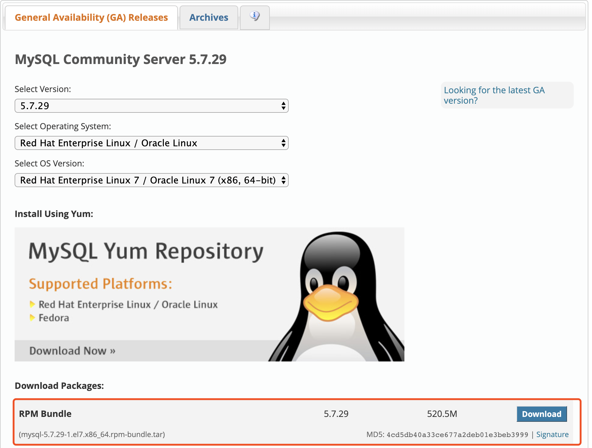

# MYSQL 5.7.29 社区版离线安装配置

参考文献：[mysql安装](http://blog.hming.org/2018/12/08/CentOS7%E4%B8%8B%E7%A6%BB%E7%BA%BF%E5%AE%89%E8%A3%85MySQL/)
# 1.下载
下载地址：
[https://dev.mysql.com/downloads/mysql/5.7.html#downloads](https://dev.mysql.com/downloads/mysql/5.7.html#downloads)


# 2.安装异常
镜像打包时，出现以下错误，提示缺少依赖包:
```shell script
warning: mysql-community-server-5.7.29-1.el7.x86_64.rpm: Header V3 DSA/SHA1 Signature, key ID 5072e1f5: NOKEY
error: Failed dependencies:
        /usr/bin/perl is needed by mysql-community-server-5.7.29-1.el7.x86_64
        libnuma.so.1()(64bit) is needed by mysql-community-server-5.7.29-1.el7.x86_64
        libnuma.so.1(libnuma_1.1)(64bit) is needed by mysql-community-server-5.7.29-1.el7.x86_64
        libnuma.so.1(libnuma_1.2)(64bit) is needed by mysql-community-server-5.7.29-1.el7.x86_64
        perl(Getopt::Long) is needed by mysql-community-server-5.7.29-1.el7.x86_64
        perl(strict) is needed by mysql-community-server-5.7.29-1.el7.x86_64

```
安装所需依赖
```shell script
yum install -y libaio numactl perl
```
